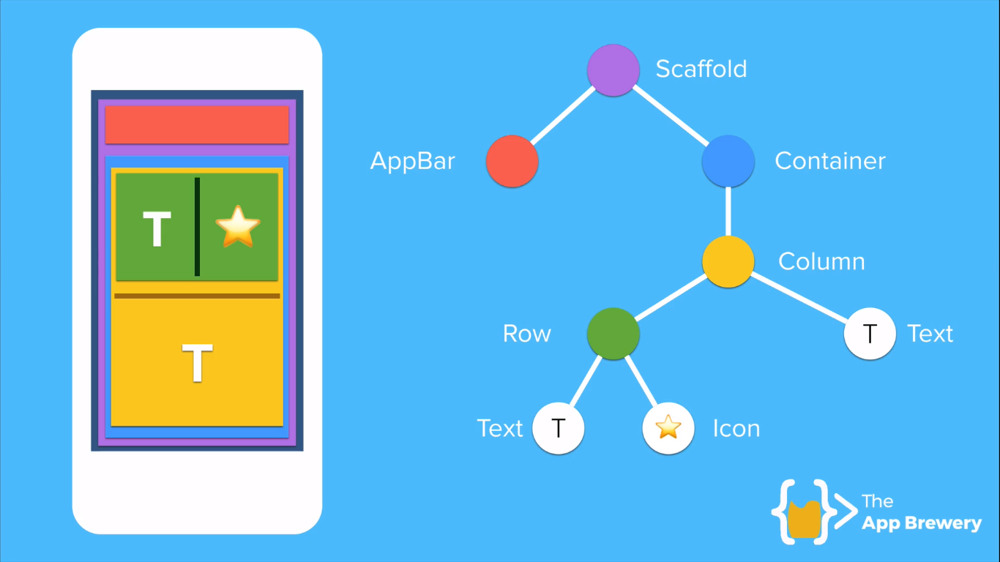
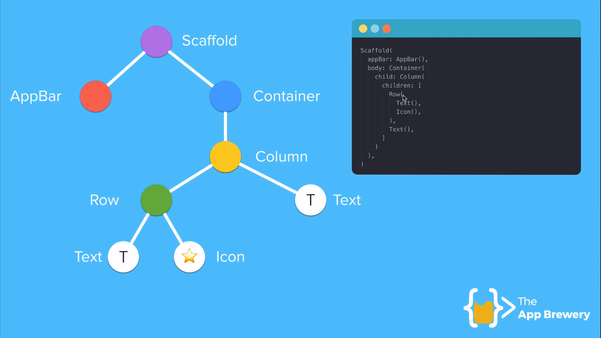

# Learning-Flutter
This repository contains course content and code written by me during my online flutter learning course on appbrewery.co

> **[Course Resources](https://github.com/londonappbrewery/Flutter-Course-Resources/blob/master/README.md)**

> **[Syllabus](App%20Brewery%20Flutter%20Course%20Syllabus.pdf)**

### Structure of Flutter App

